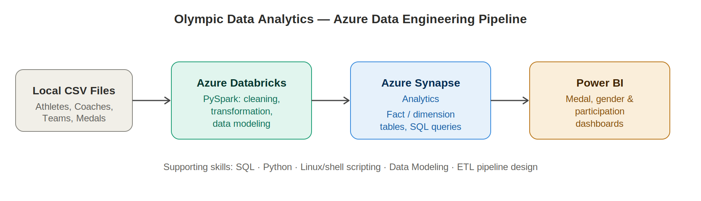

# Olympic Data Analytics | Azure End-to-End Data Engineering Project

An end-to-end data engineering pipeline that ingests, cleans, transforms, models, and
visualizes Olympic Games data using PySpark on Azure Databricks, Azure Synapse Analytics,
and Power BI.



## Project overview

This project simulates a realistic data engineering workflow: raw, messy source data
(athletes, coaches, teams, gender participation, medal counts) is cleaned and transformed
with PySpark, structured into a star schema (fact and dimension tables), loaded into a
cloud data warehouse, and surfaced through interactive BI dashboards.

It's designed to demonstrate the core skill set expected of a data engineer: data cleaning,
transformation logic, data modeling, warehouse loading, SQL analysis, and dashboard delivery
— using a dataset (Olympic Games) that's intuitive to explain in an interview.

## Tech stack

| Stage             | Tool / Skill                              |
|--------------------|--------------------------------------------|
| Data source         | Local CSV files (Athletes, Coaches, Teams, EntriesGender, Medals) |
| Transformation       | Azure Databricks (PySpark)                |
| Data modeling        | Star schema — fact & dimension tables      |
| Data warehouse        | Azure Synapse Analytics                    |
| Analysis             | SQL                                          |
| Visualization         | Power BI                                    |
| Supporting skills      | Python, SQL, Linux/shell scripting, ETL pipeline design |

## Project structure

```
olympic-data-analytics/
├── README.md
├── data/
│   ├── generate_data.py        # generates the sample datasets below
│   ├── Athletes.csv
│   ├── Coaches.csv
│   ├── Teams.csv
│   ├── EntriesGender.csv
│   └── Medals.csv
├── notebooks/
│   └── 01_transform_olympic_data.py   # Databricks PySpark notebook (source format)
├── sql/
│   ├── 01_create_tables.sql     # Synapse table DDL
│   ├── 02_load_data.sql         # COPY INTO load scripts
│   └── 03_analytical_queries.sql # Queries powering the dashboard
├── powerbi/
│   └── dashboard_guide.md       # DAX measures + dashboard layout
└── diagrams/
    ├── architecture.svg
    └── architecture.png
```

## How the pipeline works

1. **Ingestion** — Raw CSV files (`/data`) are uploaded directly into Databricks (DBFS).
   No orchestration tool is used for ingestion in this version — see "Next steps" below
   for the planned upgrade.
2. **Cleaning & transformation** (`notebooks/01_transform_olympic_data.py`) — PySpark handles:
   - Removing duplicate athlete records
   - Filling/handling nulls (missing country, missing birth year, missing event type)
   - Deriving new fields (e.g. athlete age at the Games)
   - Recomputing and validating totals (medal totals, gender participation totals)
3. **Data modeling** — Cleaned data is restructured into a star schema:
   - **Dimensions:** `dim_country`, `dim_discipline`, `dim_athlete`
   - **Facts:** `fact_medals`, `fact_gender_participation`, `fact_athlete_counts`
4. **Warehousing** — Curated tables are exported and loaded into Azure Synapse Analytics
   via `COPY INTO` (`sql/02_load_data.sql`), where they're queried with standard SQL.
5. **Visualization** — Power BI connects to Synapse and presents three dashboard pages:
   medal overview, participation & demographics, and a country deep-dive
   (`powerbi/dashboard_guide.md` has the exact DAX measures and layout).

## Getting started

1. Generate the sample data:
   ```bash
   cd data
   python3 generate_data.py
   ```
2. Upload the generated CSVs to your Databricks workspace (DBFS or Unity Catalog volume).
3. Open `notebooks/01_transform_olympic_data.py` in Databricks (import as a notebook),
   update `RAW_PATH` to match your upload location, and run all cells.
4. In Azure Synapse Studio, run `sql/01_create_tables.sql` to create the schema, then
   update the storage account / SAS token placeholders in `sql/02_load_data.sql` and run it.
5. Run the queries in `sql/03_analytical_queries.sql` to sanity-check the loaded data.
6. Open Power BI Desktop, follow `powerbi/dashboard_guide.md` to connect to Synapse (or the
   local CSVs for a quick test) and rebuild the dashboard.

## Sample insights the dashboard surfaces

- Top-performing countries by total medal count (gold/silver/bronze breakdown)
- Gender participation balance by discipline
- Average athlete age by discipline
- Medal efficiency — medals won per athlete sent, by country

## Next steps / planned upgrades

- Add **Azure Data Factory** to orchestrate ingestion from source → **ADLS Gen2**
  (currently data is uploaded directly into Databricks), turning this into a full
  bronze/silver/gold medallion architecture.
- Add a **data quality framework** (e.g. Great Expectations or dbt tests) to validate
  the cleaned data before it's loaded into Synapse.
- Parameterize the Databricks notebook to run as a scheduled **Databricks Job**.

## Resume description

> **Olympic Data Analytics | Azure End-to-End Data Engineering Project**
> Built an end-to-end data pipeline to ingest, clean, and analyze Olympic Games datasets
> using PySpark on Azure Databricks; applied data modeling principles to structure
> transformed data into fact/dimension tables; loaded curated data into Azure Synapse
> Analytics for SQL-based querying; and built interactive Power BI dashboards visualizing
> medal distribution, gender participation trends, and country-level performance.
